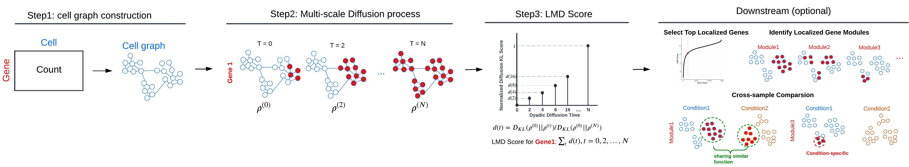

# Localized Marker Detector

<!-- badges: start -->
<!-- badges: end -->

Localized Marker Detector (LMD) is a computational framework designed
for the identification of gene expression markers localized to specific
cell populations within single-cell RNA sequencing data. The major
workflow of LMD comprises the following three main steps:

-   Step1. Constructing a cell-cell affinity graph
-   Step2. Diffusing the gene expression value across the cell graph
-   Step3. Assigning a score to each gene based on the dynamics of its
    diffusion process
-   Optional Downstream tasks
    -   Identifying gene modules and characterizing functional cell
        groups
    -   Cross-sample comparison



## Installation

LMD can be installed in R as follows:

``` r
install.packages("devtools")
devtools::install_github("KlugerLab/LocalizedMarkerDetector")

library("LocalizedMarkerDetector")
```

## Docker Installation

Alternatively, we provide a Docker environment with LMD and all its
dependencies pre-installed. The pre-built Docker image can be downloaded
using:

``` bash
docker pull ruiqi0130/lmd-rstudio:lastest
```

and to run the docker container:

``` bash
docker run -it --rm --name lmd -p 8029:8787  -v /data/:/data/   docker.io/ruiqi0130/lmd-rstudio:latest
```

Here, change `/data:/data` to `<your_local_data_directory>:/data`. A
rstudio will be on port 8029.

## Example tutorial

Please check [LMD
tutorial](https://KlugerLab.github.io/LocalizedMarkerDetector/articles/).

## References

References of LMD functions can be found
[here](https://KlugerLab.github.io/LocalizedMarkerDetector/reference/index.html).

<!-- Data used in this tutorial can be downloaded from [Tabula Muris](https://figshare.com/ndownloader/files/13092380). -->
